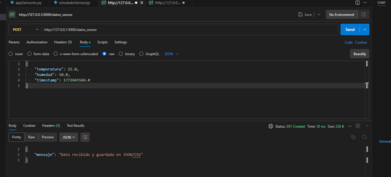

# API REST de Telemetría e Monitoreo de Sensores IoT con Flask

## Creador
* Francisco Javier Bernal Calvo

## Descripción
Sistema de monitoreo de telemetría y sensores IoT desarrollado en Python utilizando el framework Flask. La aplicación actúa como servidor backend recibiendo lecturas en tiempo real (temperatura y humedad), almacenándolas con persistencia de datos en formatos **JSON** y **CSV**, y proporcionando un endpoint de análisis estadístico que calcula promedios de humedad, temperaturas máximas/mínimas y total de registros almacenados.

El proyecto incluye también un script simulador que automatiza el envío continuo de datos simulados hacia el servidor HTTP.

## Archivos del Proyecto
* `appSensores.py`: Servidor Flask principal que gestiona la recepción de datos (`/datos_sensor`) y el cálculo de métricas estadísticas (`/estadisticas`).
* `simuladorSensor.py`: Cliente en Python que simula la recolección periódica de un sensor de temperatura y humedad enviando peticiones POST cada 5 segundos.


## Información del Proyecto, Configuraciones e Instrucciones
* **Lenguaje:** Python 3.x
* **Framework Backend:** Flask
* **Librerías requeridas:** `flask`, `requests`
* **Herramienta de Pruebas:** Postman / cURL

### Instrucciones de Instalación y Ejecución

1. Clonar el repositorio o descargar los archivos.
2. Instalar las dependencias necesarias:
   ```bash
   pip install flask requests

  
